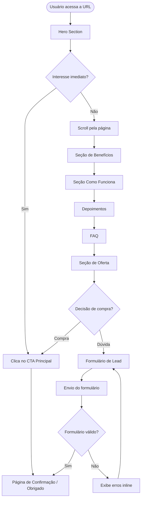
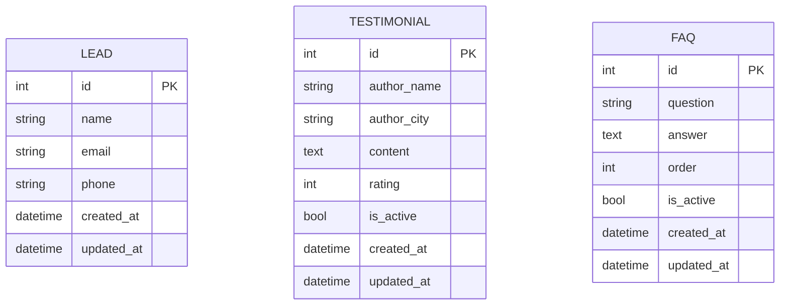

# PRD — SlimChoco: Landing Page de Chocolate Emagrecedor

> **Versão:** 1.0  
> **Data:** 22/04/2026  
> **Status:** Em desenvolvimento

---

## 1. Visão Geral

O **SlimChoco** é uma landing page de alta conversão para um chocolate emagrecedor funcional. O produto combina o prazer do chocolate meio amargo com ingredientes que auxiliam na redução de medidas, controle do apetite e saúde intestinal. A página tem como objetivo principal converter visitantes em compradores, capturando leads e direcionando o usuário a uma ação de compra clara e objetiva.

---

## 2. Sobre o Produto

**SlimChoco** é um chocolate emagrecedor meio amargo, 80g, sem açúcar, fonte de fibras prebióticas, com fórmula avançada que promete:

- Acelerar o metabolismo e auxiliar na queima de gordura
- Controle do apetite com mais saciedade e menos compulsão
- Saúde intestinal por meio de fibras prebióticas
- Redução de medidas com ingredientes naturais

**Slogan:** *"Sabor que dá prazer. Resultados que você vê!"*

---

## 3. Propósito

Criar uma landing page funcional, moderna e de alta conversão usando Django full stack com Tailwind CSS, servindo como peça de portfólio e demonstrando domínio de:

- Desenvolvimento web com Django e DTL (Django Template Language)
- Design responsivo com Tailwind CSS
- Boas práticas de código Python (PEP 8)
- Arquitetura limpa e sem over-engineering

---

## 4. Público-Alvo

| Perfil | Descrição |
|---|---|
| **Primário** | Mulheres entre 25–50 anos em busca de emagrecimento saudável |
| **Secundário** | Pessoas com restrição ao açúcar que não abrem mão do chocolate |
| **Comportamental** | Usuários que buscam praticidade, produtos naturais e resultados visíveis |
| **Geográfico** | Brasil (interface 100% em português brasileiro) |

---

## 5. Objetivos

1. Apresentar o produto SlimChoco de forma atrativa e convincente
2. Capturar leads via formulário de interesse/contato
3. Direcionar o usuário para a ação de compra (CTA claro)
4. Exibir depoimentos e provas sociais para aumentar credibilidade
5. Ser 100% responsivo e performático

---

## 6. Requisitos Funcionais

### 6.1 Seções da Landing Page

- **RF01** — Hero section com headline impactante, subheadline, imagem do produto e botão CTA principal
- **RF02** — Seção de benefícios com ícones (Acelera Metabolismo, Controle do Apetite, Saúde Intestinal, Sem Açúcar)
- **RF03** — Seção "Como funciona" com passo a passo visual
- **RF04** — Seção de depoimentos/avaliações de clientes
- **RF05** — Seção de FAQ (Perguntas Frequentes) com acordeão
- **RF06** — Formulário de captura de lead (nome, e-mail, telefone opcional)
- **RF07** — Seção de oferta/preço com CTA de compra
- **RF08** — Footer com informações legais e links básicos

### 6.2 Funcionalidades Técnicas

- **RF09** — Submissão do formulário de lead salva no banco de dados SQLite
- **RF10** — Página de confirmação/agradecimento após envio do formulário
- **RF11** — Validação de formulário no servidor (Django Forms)
- **RF12** — Proteção CSRF em todos os formulários

### 6.3 Flowchart de UX



---

## 7. Requisitos Não-Funcionais

| ID | Requisito | Critério |
|---|---|---|
| RNF01 | Responsividade | Layout funcional em mobile (320px+), tablet e desktop |
| RNF02 | Performance | Carregamento inicial < 3s em conexão 4G |
| RNF03 | Simplicidade | Sem over-engineering; código direto e legível |
| RNF04 | Padrão de código | PEP 8 estrito; aspas simples; código em inglês |
| RNF05 | Banco de dados | SQLite padrão do Django |
| RNF06 | Segurança | CSRF habilitado; sem dados sensíveis expostos |
| RNF07 | Interface | 100% em português brasileiro |
| RNF08 | Manutenibilidade | CBVs (Class Based Views) sempre que aplicável |

---

## 8. Arquitetura Técnica

### 8.1 Stack

| Camada | Tecnologia |
|---|---|
| **Backend** | Python 3.12+ / Django 5.x |
| **Frontend** | Django Template Language (DTL) |
| **Estilização** | Tailwind CSS (via CDN ou CLI) |
| **Banco de dados** | SQLite (padrão Django) |
| **Servidor dev** | Django `runserver` |

### 8.2 Estrutura do Projeto

```
slimchoco/
├── manage.py
├── requirements.txt
├── slimchoco/              # Projeto Django (settings, urls, wsgi)
│   ├── settings.py
│   ├── urls.py
│   └── wsgi.py
├── landing/                # App principal
│   ├── migrations/
│   ├── templates/
│   │   └── landing/
│   │       ├── base.html
│   │       ├── index.html
│   │       └── thank_you.html
│   ├── static/
│   │   └── landing/
│   │       └── images/
│   ├── models.py
│   ├── views.py
│   ├── forms.py
│   ├── urls.py
│   └── admin.py
└── static/                 # Arquivos estáticos globais
```

### 8.3 Schema de Dados (Mermaid)



---

## 9. Design System

### 9.1 Paleta de Cores

Inspirada nas embalagens do produto (marrom chocolate escuro + dourado/âmbar + bege areia):

| Nome | Hex | Classe Tailwind (custom) | Uso |
|---|---|---|---|
| Chocolate Escuro | `#2C1A0E` | `bg-chocolate-dark` | Fundo hero, navbar |
| Chocolate Médio | `#4A2C17` | `bg-chocolate` | Cards, seções alternadas |
| Dourado | `#C9A227` | `text-gold` / `bg-gold` | CTAs, destaques, badges |
| Dourado Claro | `#E8C84A` | `text-gold-light` | Hover, ícones |
| Bege Areia | `#D2B48C` | `bg-sand` | Fundo seções claras |
| Creme | `#F5EDD6` | `bg-cream` | Fundo alternado |
| Branco | `#FFFFFF` | `text-white` | Texto principal em fundo escuro |
| Cinza Escuro | `#1A1A1A` | `text-dark` | Texto em fundo claro |

**Gradientes:**
```html
<!-- Hero gradient -->
<div class="bg-gradient-to-br from-[#2C1A0E] via-[#4A2C17] to-[#2C1A0E]">

<!-- CTA gradient -->
<div class="bg-gradient-to-r from-[#C9A227] to-[#E8C84A]">

<!-- Seção clara -->
<div class="bg-gradient-to-b from-[#F5EDD6] to-[#D2B48C]">
```

### 9.2 Tipografia

| Papel | Fonte | Classe Tailwind |
|---|---|---|
| Título principal | Inter Bold / Playfair Display | `font-bold text-4xl md:text-6xl` |
| Subtítulo | Inter SemiBold | `font-semibold text-xl md:text-2xl` |
| Corpo | Inter Regular | `text-base leading-relaxed` |
| Destaque/Slogan | Italic Bold | `font-bold italic text-[#C9A227]` |

### 9.3 Botões

```html
<!-- CTA Primário (dourado) -->
<button class="bg-gradient-to-r from-[#C9A227] to-[#E8C84A] text-[#2C1A0E]
               font-bold py-4 px-8 rounded-full text-lg
               hover:shadow-lg hover:scale-105 transition-all duration-300
               uppercase tracking-wider">
  Quero meu SlimChoco
</button>

<!-- CTA Secundário (outline) -->
<button class="border-2 border-[#C9A227] text-[#C9A227]
               font-semibold py-3 px-6 rounded-full
               hover:bg-[#C9A227] hover:text-[#2C1A0E]
               transition-all duration-300">
  Saiba mais
</button>
```

### 9.4 Inputs e Formulários

```html
<input type='text'
  class='w-full bg-white/10 border border-[#C9A227]/40 rounded-lg
         px-4 py-3 text-white placeholder-white/50
         focus:outline-none focus:border-[#C9A227] focus:ring-1 focus:ring-[#C9A227]
         transition-all duration-200'>

<label class='block text-white/80 text-sm font-medium mb-1'>
```

### 9.5 Cards de Benefício

```html
<div class='bg-white/5 border border-[#C9A227]/20 rounded-2xl p-6
            hover:border-[#C9A227]/60 hover:bg-white/10
            transition-all duration-300 text-center'>
  <!-- ícone + título + descrição -->
</div>
```

### 9.6 Grid e Layout

```html
<!-- Container principal -->
<div class='max-w-6xl mx-auto px-4 sm:px-6 lg:px-8'>

<!-- Grid de benefícios (2 cols mobile, 4 cols desktop) -->
<div class='grid grid-cols-2 md:grid-cols-4 gap-6'>

<!-- Grid de depoimentos (1 col mobile, 3 cols desktop) -->
<div class='grid grid-cols-1 md:grid-cols-3 gap-8'>
```

### 9.7 Navbar

```html
<nav class='fixed top-0 w-full bg-[#2C1A0E]/95 backdrop-blur-sm z-50
            border-b border-[#C9A227]/20'>
  <div class='max-w-6xl mx-auto px-4 py-3 flex justify-between items-center'>
    <!-- Logo + CTA -->
  </div>
</nav>
```

---

## 10. User Stories

### Épico 1 — Descoberta e Engajamento

| ID | User Story | Critérios de Aceite |
|---|---|---|
| US01 | Como visitante, quero ver o produto e seus benefícios logo ao entrar na página, para entender rapidamente o que está sendo oferecido. | [ ] Hero section visível sem scroll com headline, imagem e CTA [ ] Benefícios listados com ícones abaixo do hero [ ] Carregamento < 3s |
| US02 | Como visitante, quero saber como o produto funciona, para ter confiança antes de comprar. | [ ] Seção "Como Funciona" com mínimo 3 passos [ ] Linguagem clara e direta em PT-BR |
| US03 | Como visitante, quero ler depoimentos de outros clientes, para aumentar minha confiança no produto. | [ ] Mínimo 3 depoimentos exibidos [ ] Depoimentos com nome, cidade e avaliação em estrelas |

### Épico 2 — Captura de Lead

| ID | User Story | Critérios de Aceite |
|---|---|---|
| US04 | Como visitante interessado, quero preencher um formulário de interesse, para ser contactado ou receber mais informações. | [ ] Formulário com campos nome, e-mail e telefone opcional [ ] Validação de campos obrigatórios no servidor [ ] Mensagem de erro inline em caso de dados inválidos |
| US05 | Como visitante que enviou o formulário, quero ver uma página de confirmação, para saber que meu interesse foi registrado. | [ ] Redirecionamento para página de agradecimento após envio válido [ ] Mensagem de confirmação clara em PT-BR |

### Épico 3 — FAQ e Suporte

| ID | User Story | Critérios de Aceite |
|---|---|---|
| US06 | Como visitante com dúvidas, quero acessar uma seção de perguntas frequentes, para resolver minhas dúvidas sem precisar de suporte. | [ ] Mínimo 5 perguntas e respostas [ ] Componente acordeão funcional (abrir/fechar) [ ] Responsivo em mobile |

### Épico 4 — Conversão

| ID | User Story | Critérios de Aceite |
|---|---|---|
| US07 | Como visitante convencido, quero clicar em um botão de compra claro, para ser direcionado ao checkout. | [ ] CTA visível em múltiplas seções [ ] Botão com link configurável via Django settings/admin [ ] Estilo dourado em destaque |

---

## 11. Métricas de Sucesso

### 11.1 KPIs de Produto

| KPI | Meta | Como medir |
|---|---|---|
| Taxa de conversão de leads | ≥ 5% dos visitantes | Leads cadastrados / visitas totais |
| Taxa de rejeição (bounce rate) | < 60% | Análise de sessão |
| Tempo médio na página | > 2 minutos | Análise de comportamento |

### 11.2 KPIs de Usuário

| KPI | Meta | Como medir |
|---|---|---|
| Formulários enviados com sucesso | ≥ 90% das tentativas | Envios válidos / tentativas totais |
| Scroll depth | ≥ 70% chegam ao formulário | Profundidade de scroll |
| Cliques no CTA principal | ≥ 15% dos visitantes | Cliques no botão hero |

### 11.3 KPIs Técnicos

| KPI | Meta |
|---|---|
| Cobertura de responsividade | Mobile, tablet e desktop sem quebras |
| Ausência de erros 500 | 0 erros em produção |
| Tempo de resposta do servidor | < 200ms para páginas estáticas |

---

## 12. Riscos e Mitigações

| Risco | Probabilidade | Impacto | Mitigação |
|---|---|---|---|
| Over-engineering acidental | Média | Alto | Revisão constante do escopo; sem abstrações desnecessárias |
| Layout quebrado em mobile | Média | Alto | Testar com DevTools em múltiplos breakpoints desde o início |
| Formulário com spam/abuse | Baixa | Médio | Adicionar honeypot simples no formulário |
| Dependência do CDN Tailwind | Baixa | Médio | Documentar versão usada; migrar para CLI em sprint final |
| Dados de lead perdidos | Baixa | Alto | Admin Django habilitado para visualização dos leads |

---

*Documento gerado em 22/04/2026 — SlimChoco Landing Page PRD v1.0*
